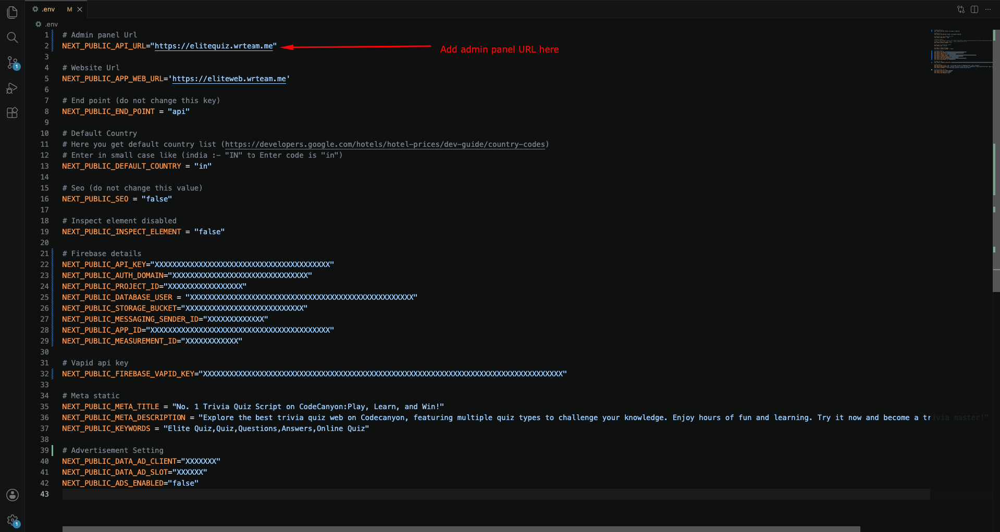
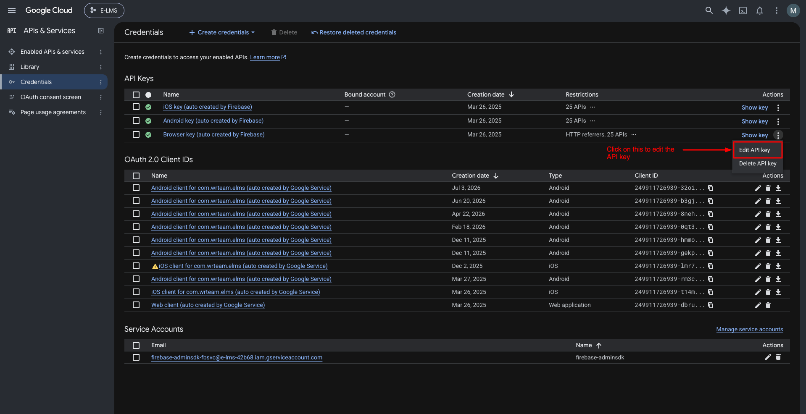
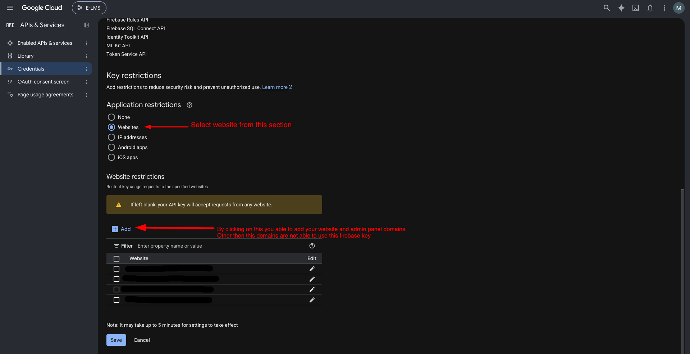

import DocBanner from '@site/src/components/DocBanner';

<DocBanner />

# Web Setup Overview

## 1. Extract the Project Files

Unzip the downloaded code package. This will create an "Elite Quiz - Web Code" folder.

## 2. Open the Project

Launch Visual Studio Code (or your preferred code editor) and open the project folder.

## Where to Set API URL (Admin)

1. Go to the main folder and open the `.env` file
2. Set your admin panel URL like this: `https://www.example.com`

## Why This is Important

Setting the correct API URL is crucial for the web application to communicate with your backend server. Make sure the URL is accessible and properly formatted including the protocol (http:// or https://).

:::caution
If the API URL is incorrect, users won't be able to log in or access quiz data.
:::

## Secure Your Firebase API Key

The Firebase browser API key is visible in your web app's code. Restrict it so only your own website can use it.

### 1. Edit the Browser API Key

Go to **Google Cloud Console → APIs & Services → Credentials** and open the **Browser key** used by your Firebase web app.

### 2. Restrict the API Key to Your Website Domains

Under **Application restrictions**, select **Websites** and add your Elite Quiz web domain(s), for example `https://www.example.com/*`. Click **Save**.

:::warning
Your Firebase **private key** (service account JSON) gives full access to your Firebase project. Never share it, post it publicly, or commit it to a public repository. If it is exposed, delete it from Firebase and generate a new one immediately.
:::

### Important Notes

- Keep your Firebase **private key** safe. Generate it from **Project Settings → Service accounts → Generate new private key**. The Elite Quiz Admin Panel uses this file, so upload it only there.
- Add every domain that serves your web app (including `www` and non-`www`) to the allowed list, or Firebase login will fail on the missing domain.
- Keep credentials out of your `.env` files in public repositories.
- Review Firebase usage regularly and watch for unexpected spikes.
- Follow Firebase best practices and stay updated with Firebase changes.
